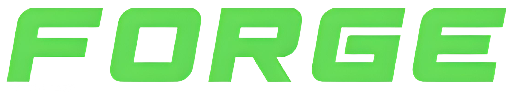
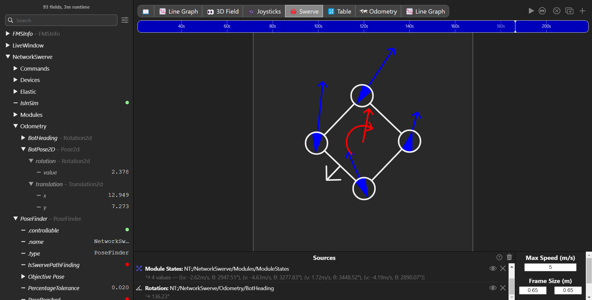

# Welcome to Forge Documentation

[Go to Downloads](page1.md){ .md-button .md-button--primary }

For source code visit [github.com/Imcab](https://github.com/Imcab).

## Why Forge?

*For Optimization Revolution Greatest Excellence (FORGE)* , is an FIRST Robotics Competition perfomance library made by team FRC 3472, focusing on making the robot program easier, better and ensuring perfomance.

Forge is an **open-source library** consisting in 7 implementations going for **PID constants, or other profile constants** to a **plug-and-play** Swerve pathfinder! But thats not all, Forge also includes easy **simulation implementation** to your robot programm, but the strongest feauture of Forge is `NetworkTablesUtil`, autoPublish values to the NetworkTables, publish any type of data going for simple `double` to `Pose2d`,`SwerveModuleState[]`, `Commands` that you can run with a button; with this feature, if you can image it you can publish it, also comes with other small utils like **flipping poses, math operations**, `Equals`, Forge has it **all** to make your robot's performance rocket up!

Forge includes various features as:

-    ✦ __Easy setup__

    ---

    Install the zip from [downloads](page1.md), create a `/lib/Forge` folder in `src/main/java/` and put it into your robot code in `lib/Forge` and thats all, you have now fully access to all Forge features!

-   ✦ __Documentation__

    ---

    All the methods, classes and functionalities are well-documentated!

-   ✦ __Made for AdvantageScope__

    ---

    Forge also makes a lot easier interact with Advantage Scope and other Dashboards and also easy for Custom Dashboards!

-    ✦ __Simulation Support__

    ---

    Makes simulation too much easiear and makes simulating your code without tools such as `AdvantageKit` way to easier without having a mess!

-    ✦ __SwerveLib__

    ---

    `PathPlanner` Required.  Plug-and-Play pathfinding implementation without
    having to worry about pose flipping or any aditional set-up. Also has a `SwerveWidget` class for dashboard use!

-    ✦ __Open Source__

    ---

    Forge is fully Open Source under MIT's licence!
    
    

## Supported Languages

Forge was made for **Java**, C++ or other languages are **NOT** supported.
