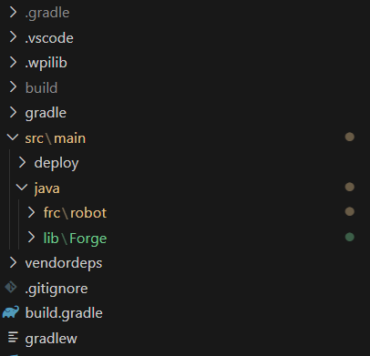
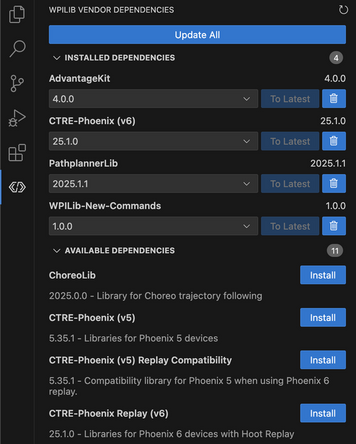

# Getting Started

## Instalation guide

### New projects

The best way to download Forge if you don't have a project is downloading the empty template:

[Download template](https://github.com/Imcab/ForgeLibTemplate){ .md-button .md-button--primary }

This will come with the last forge update and all the setup required to using forge as freely as you wish.

### Existing projects

To download Forge just go to [releases](#forge-releases) and download the lasted vertion of Forge. If you just want to download one
of the various Forge features go to [individual releases](#individual-releases) and download the feature you just want.

!!! info

    Individual feature downloads are supported as long as you store it in the [`/lib`](#) folder or **manually change the package directory** to your desired one.

After you download Forge or a Forge individual release, **unzip the file** then, go to your robot proyect and go to **`src/main/java/`**, create a `/lib` folder and paste **`src/main/java/lib/HERE`**, at the end your robot code should see like this: **`src/main/java/lib/Forge`**

### PathPlanner VendorDep

Because **SwerveLib** depends on [pathplanner](https://pathplanner.dev/home.html) to function, before starting to use forge, you **must** install [pathplannerLib](https://pathplanner.dev/pplib-getting-started.html#install-pathplannerlib).

For 2025 the easiest way to install it is through WPILib Vendor Dependency Manager in VSCode.

### RevLib VendorDep

The REV feature, needs the last [REVLIB](https://docs.revrobotics.com/revlib) vendordep, you can install it like pathplanner's vendor.

!!! warning
    You **MUST** install PathPlannerLib and RevLib for SwerveLib to work!

If the location of the Forge was right and [pathplanner](https://pathplanner.dev/home.html) and 
[REVLIB](https://docs.revrobotics.com/revlib)
is **already installed**, you shouldn't get any errors and you can start using Forge features!

### Forge Releases

[Download](https://github.com/Imcab/ForgeLib/tree/main/lib/Forge){ .md-button .md-button--primary }

Includes:

- [NetworkTablesUtil](#networktablesutil)
- [Sim](#sim)
- [SwerveLib](#swervelib)
- [Equals](#equals)
- [Field](#field)
- [Math](#math)
- [RobotState](#robotstate)
- [REV](#rev)

### Individual Releases

#### NetworkTablesUtil

NetworkTablesUtil is a Forge feature, it includes features as:

- Elastic support
- Auto publish data to NetworkTables
- Listeners
- Advantage Scope / Dashboards friendly
- Tunnable numbers through NetworkTables
- Support on publishing over **30 diferent data types!**
- Retrieve over **30 diferent data types!**
- Special custom made publishers such as swerve, poseEstimator and joysticks
- New Subsystem type NetworkSubsystem for more easy use and precise control over NetworkTables
- Auto publishing commands

[Go to repo](page1.md){ .md-button .md-button--primary }

#### Sim

Sim is a Forge feature, it includes features as:

- Handle both real implementations and simulation implementations in a single class
- With the `Device` feature, only create objects based on current robot reality
- Advantage Scope / Dashboards friendly
- Interface to implement to all type of classes

[Go to repo](page1.md){ .md-button .md-button--primary }

#### SwerveLib

SwerveLib is a Forge feature, it includes features as:

- Perfomance odometer with automatic **Field2d** widget display
- `PoseFinder class`, plug and play posefinding class using pathplanner
- Advantage Scope / Dashboards friendly
- Easy elastic swerve widget implementation

!!! warning
    You **MUST** install PathPlannerLib for SwerveLib to work!

[Go to repo](page1.md){ .md-button .md-button--primary }

#### Equals

Equals is a Forge feature, featuring:

- Comparor class for comparing 2 or more data types within the same line!
- Domains from x value to y to check if a given value b is within tolerance
- TwoDimensional Spaces from checking if b (2d object having x and y components) is at f and g
- ThreeDimensional Spaces
- Epsilon equals for safe and constant comparison

[Go to repo](page1.md){ .md-button .md-button--primary }

#### Field

Field is a Forge feature, featuring:

- Easy storage of a field object, giving its length and width
- Dashboard Support
- Easy `PoseFlipper class` for flipping blue alliance poses to red ones
- Alliance util

[Go to repo](page1.md){ .md-button .md-button--primary }

#### Math

Math is a Forge feature, featuring:

- Smooth double suppliers outputs by a constant kJ
- BooleanTriggers
- Single Operations and Operations
- Angle operations such as coterminal and new atan 3
- More flexible pid wrapper classes
- Feedforward
- PID loops
- MotionModel (Trapezoidal control)
- Cascade control (currently supporting only PID loops)

Custom constants for frc:

- PID
- PIDF
- SimpleFeedforward
- CompleteFeedForward
- MotionModel (for trapezoidal controls or motionModels profiles such as MaxMotion, MotionMagic)
- MotionModelExpo featuring the use of a jerk term

[Go to repo](page1.md){ .md-button .md-button--primary }

#### RobotState

Includes an interface called `RobotLifeCycle` which gives the class the hability to interact with all the modes of the robot:

- Teleop init
- Teleop
- Teleop exit
- Auto
- Auto Exit
- Auto init
- Robot disabled

[Go to repo](page1.md){ .md-button .md-button--primary }

#### REV

Forge REV feauture supports setting the use for REVBlinkin more friendly and having all the patterns Rev has.
Also has methods to get the current pattern and methods to check if the blinkin has an especified pattern.

Additionaly it contains a wrapper class of an `SparkMax` motor controller for fast and effective usage.

[Go to repo](page1.md){ .md-button .md-button--primary }
